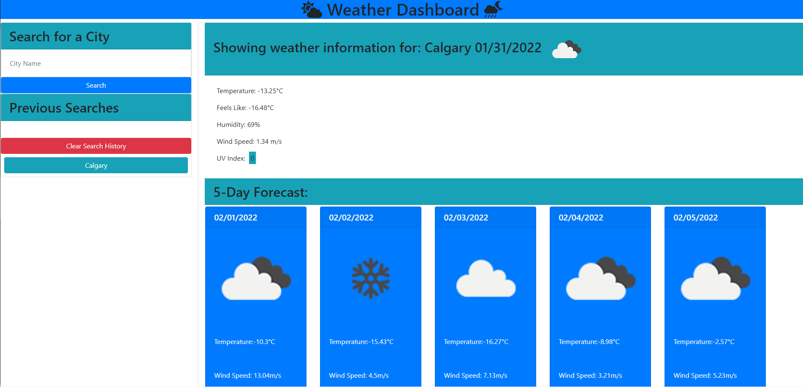

# Weather Dashboard

## Description
This is a simple Weather Dashboard application created using HTML, CSS and JS. 
 
Open Weather API was used to retrieve the weather information. 
  
You may use this application to check the weather quickly and concisely without having to view cluttered information. 
  
This application is exceptional for planning work week, planning trips, when travelling and restricted for data, and/or looking for the weather condition of the city your loved ones are located.  
## Using the application
You may enter the City Name on the left side of the page. 
 
Upon entering the name of the city, your city's information will deploy on the right. 
 
Weather information displayed will contain: 
- Temperature in Celsius,
- Feels like in Celsius,
- Humidity in percentage,
- Wind Speed in m/s, 
- UV Index

Then, you will be shown a 5-Day Forecast below for the next 5 days. 
  
Your search is contained and populated under "Previous Searches". 
 
Upon clicking the name of the city store, that said city's information will display on the right. 
 
You may also clear the search history by clicking on the "Clear Search History" button. 

## Technologies Used
In order to create this scheduler, the following 3rd party API's were used. 
 
- OpenWeather API: https://openweathermap.org/api
- FontAwesome API: https://fontawesome.com/
- Momentjs API: https://momentjs.com/
- Bootstrap: https://getbootstrap.com/

## Deployment
Website is currently deployed on Git Pages: 

https://jollypong.github.io/Weather-Dashboard/

## Repository
Repository can be accessed at: 

https://github.com/jollypong/Weather-Dashboard

Repository contains: 
- index.html
- README.md 
- assets (folder)
  - images(folder)
    - screenshot.png
  - script.js 
  - style.css
  - reset.css
     
## Screenshots

## Contribution
Joe Lee @ https://github.com/jollypong